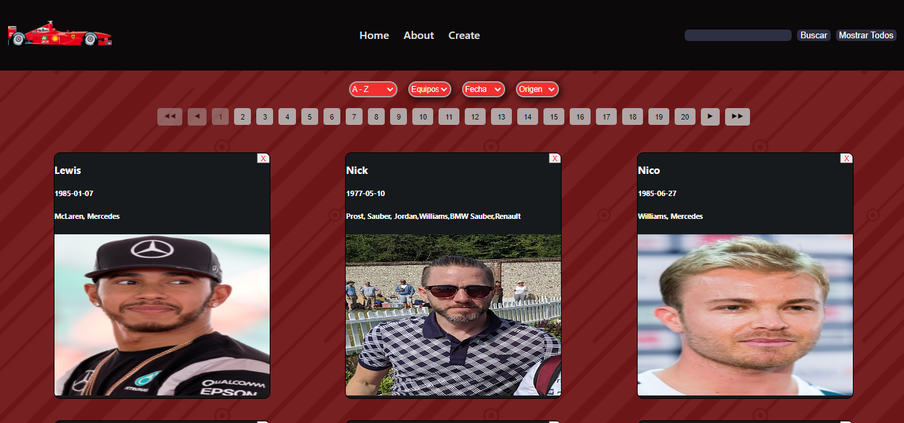

<h1 align="center">Hola 👋, soy Santiago</h1>
<h3 align="center">Un apasionado desarrollador web full-stack de Argentina</h3>

  

  

## 📖 Sobre mí

Soy un desarrollador web full-stack junior con una sólida base en una amplia gama de tecnologías tanto en Front-end como en Back-end. Mi formación me ha permitido dominar herramientas esenciales y modernas para crear aplicaciones web eficientes y dinámicas. Aquí te comparto un resumen de mi experiencia y habilidades:

- **Front-end:** Tengo experiencia en el desarrollo de interfaces atractivas y funcionales utilizando **HTML**, **CSS** (incluyendo preprocesadores como **SASS/SCSS**), y **JavaScript**. Utilizo **React** para construir aplicaciones web interactivas y dinámicas, y manejo el estado de las aplicaciones con **Redux**.

- **Back-end:** Estoy familiarizado con la creación de servidores y APIs utilizando **Node.js** y **Express**. Tengo experiencia en la gestión de bases de datos con **PostgreSQL** y la integración de ORM como **Sequelize** para facilitar la interacción con la base de datos.

- **Herramientas y Tecnologías:** Utilizo **Git** para el control de versiones, **Postman** para probar APIs, y tengo conocimientos en pruebas unitarias con **Jest**. También estoy en proceso de familiarizarme con **Firebase** para la autenticación y almacenamiento en la nube.

Me apasiona aprender nuevas tecnologías y enfrentar desafíos en el desarrollo de aplicaciones. Disfruto trabajando en equipo y colaborando en proyectos que me permiten crecer como profesional. Mi objetivo es seguir mejorando mis habilidades y contribuir a la creación de soluciones innovadoras.

Si estás interesado en colaborar en proyectos o simplemente quieres conectar, no dudes en contactarme.

## 🌐 Conéctate conmigo:

  
  

## 🛠️ Idiomas y herramientas:

   
   
   
   
   
   
   
   
   
   
   
   

## 📊 Estadísticas de GitHub:

&nbsp;

## 📂 Proyectos:

  
  

